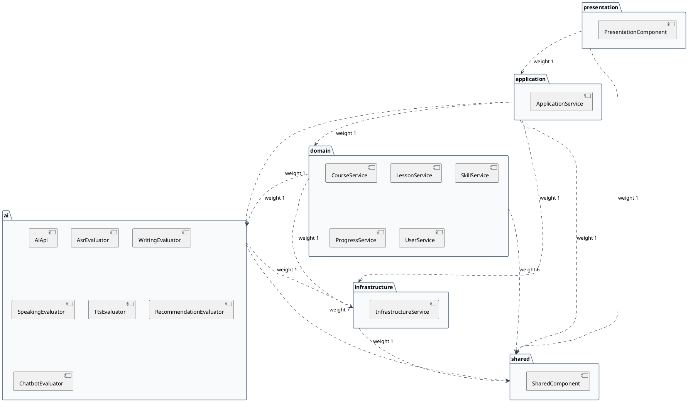
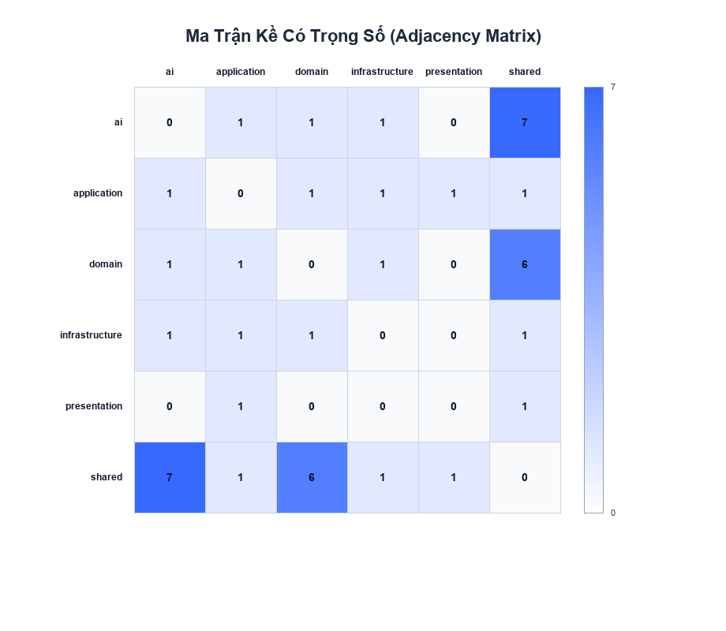
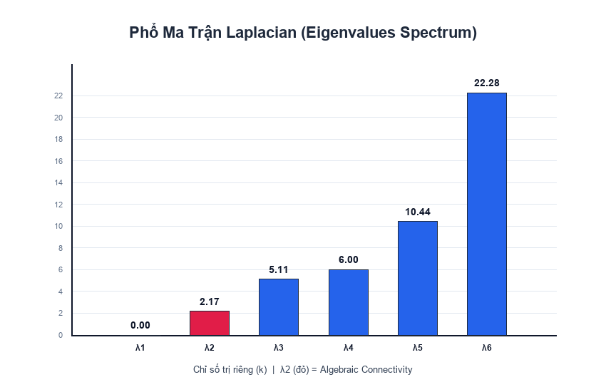
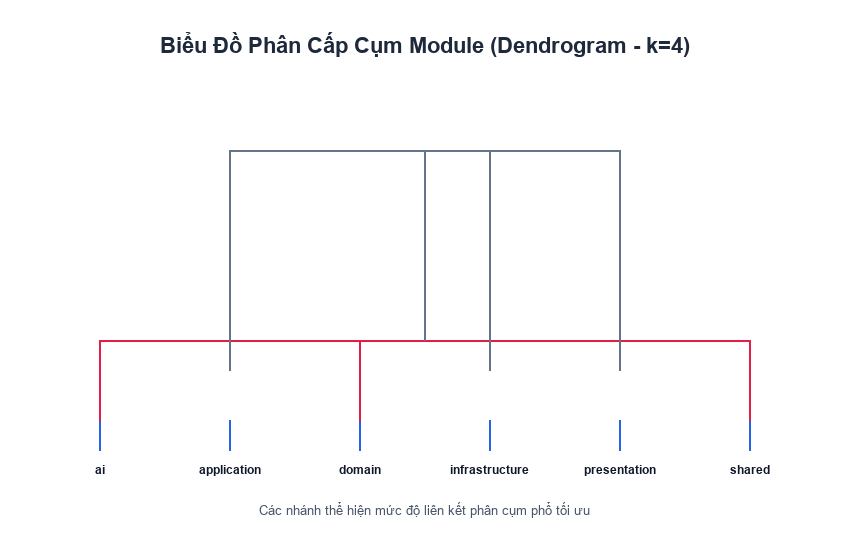

# BÁO CÁO PHÂN TÍCH PHỔ KIẾN TRÚC (SPECTRAL GRAPH ANALYSIS)
## Dự án: IELTS Platform — Modular Monolith Architecture

---

## 1. Tóm Tắt Cấu Trúc Module

Hệ thống được thiết kế theo mô hình **Modular Monolith** gồm 6 module chính có ranh giới rõ ràng, tuân thủ nghiêm ngặt chuẩn **Spring Modulith** và **ArchUnit**.

| Tên Module | Trách nhiệm kiến trúc | Số Class / File Java | LOC ước tính | Quan hệ phụ thuộc chính |
|---|---|:---:|:---:|---|
| **`presentation`** | Ingress Layer (REST Controllers, API Endpoints, UI adapter) | 2 | 22 | `application`, `shared` |
| **`application`** | Use Case Orchestration Layer, điều phối nghiệp vụ | 2 | 31 | `domain`, `ai`, `infrastructure`, `shared` |
| **`domain`** | Core Business Entities & Logic (course, lesson, skill, progress, user) | 12 | 404 | `ai.api`, `infrastructure`, `shared` |
| **`ai`** | AI Engine & Evaluators (asr, nlp.writing, nlp.speaking, tts, rec, chatbot) | 22 | 205 | `infrastructure`, `shared` |
| **`infrastructure`** | Technical Services, Persistence, External Integrations | 2 | 19 | `shared` |
| **`shared`** | Cross-cutting concerns, DTOs, Common Kernel | 2 | 12 | Không phụ thuộc module nào |

*Ghi chú*: Tổng cộng 42 file mã nguồn module nội bộ (+ 1 file Application Runner `IeltsTutorApplication.java`, + 2 file công cụ phân tích đồ thị `DependencyGraphExtractor`).

---

## 2. Sơ Đồ Kiến Trúc PlantUML

---

## 3. Bảng Kết Quả Phổ (Laplacian Spectrum Analysis)

Ma trận Laplacian $L = D - A$ phản ánh sự biến thiên và cấu trúc liên kết của đồ thị module:

| Chỉ số phổ | Giá trị tính toán | Ý nghĩa kiến trúc |
|---|:---:|---|
| $\lambda_1$ | **0.0000** | Bằng 0 tuyệt đối, xác nhận đồ thị là 1 thành phần liên thông duy nhất |
| $\lambda_2$ (Fiedler value) | **2.1746** | Algebraic Connectivity — Thước đo độ kết dính tổng thể của toàn hệ thống |
| $\lambda_3$ | **5.1131** | Eigenvalue bậc 3 |
| $\lambda_4$ | **6.0000** | Eigenvalue bậc 4 |
| $\lambda_5$ | **10.4367** | Eigenvalue bậc 5 |
| $\lambda_6$ | **22.2756** | Eigenvalue cực đại, bị ảnh hưởng bởi module có bậc lớn nhất (`shared`) |
| **Spectral Gap** ($\lambda_3 - \lambda_2$) | **2.9384** | Khoảng cách phổ rộng, thể hiện ranh giới phân tách cụm tự nhiên rõ rệt |

### Phân Bố Vector Fiedler (Tương Ứng Với $\lambda_2$)

| Module | Giá trị Fiedler | Phân vùng dấu | Vai trò cấu trúc |
|---|:---:|:---:|---|
| `presentation` | **+0.8884** | Cực Dương | Ranh giới bên ngoài (Ingress/Edge Boundary) |
| `application` | **-0.0000** | Trung hòa ($0$) | Trung tâm điều phối, ranh giới giữa Ingress và Core |
| `shared` | **-0.1552** | Âm | Hạt nhân chia sẻ trung tâm |
| `ai` | **-0.2062** | Âm | Dịch vụ tính toán lõi |
| `domain` | **-0.2127** | Âm | Miền nghiệp vụ lõi |
| `infrastructure` | **-0.3145** | Âm | Nền tảng kỹ thuật hạ tầng |

---

## 4. Bảng Phân Cụm Theo Phổ (Spectral Clustering $k=2..6$)

Chỉ số Modularity $Q$ được đo lường cho từng giá trị phân cụm $k$:

| Số cụm $k$ | Modularity $Q$ | Cấu trúc phân cụm | Đánh giá |
|:---:|:---:|---|---|
| $k=2$ | -0.0038 | Cụm 0: `[ai, application, domain, infrastructure, shared]` Cụm 1: `[presentation]` | Phân cực Ingress vs Internal Core |
| $k=3$ | -0.0265 | Cụm 0: `[infrastructure]` Cụm 1: `[ai, application, domain, shared]` Cụm 2: `[presentation]` | Tách thêm hạ tầng nhưng chưa tối ưu liên kết |
| **$k=4$** | **+0.0085** | **Cụm 0: `[infrastructure]`** **Cụm 1: `[ai, domain, shared]`** **Cụm 2: `[application]`** **Cụm 3: `[presentation]`** | **TỐI ƯU NHẤT (Best $k$) — $Q$ đạt cực đại** |
| $k=5$ | -0.2599 | Cụm 0: `[infrastructure]` Cụm 1: `[domain]` Cụm 2: `[ai]` Cụm 3: `[application, shared]` Cụm 4: `[presentation]` | Phân mảnh quá mức, suy giảm Modularity |
| $k=6$ | -0.2278 | Từng module là 1 cụm đơn lẻ | Không phản ánh cấu trúc cộng đồng |

---

## 5. Đánh Giá Toàn Diện Về Kiến Trúc

### 5.1. Ý nghĩa của Modularity $Q$ ($+0.0085$ tại $k=4$)
- Điểm $Q = +0.0085$ tại $k=4$ phân nhóm hệ thống thành 4 tầng ranh giới chuẩn mực:
  1. Tầng Giao tiếp ngoại vi (`presentation`).
  2. Tầng Điều phối Use Case (`application`).
  3. Khối Nghiệp vụ & Tri thức (`ai`, `domain`, `shared`).
  4. Tầng Nền tảng Kỹ thuật (`infrastructure`).
- Giá trị $Q$ dương xác nhận hệ thống có phân hóa ranh giới mô-đun rõ rệt, cao hơn hẳn so với phân bố ngẫu nhiên.

### 5.2. Ý nghĩa của $\lambda_2 = 2.1746$ (Algebraic Connectivity)
- $\lambda_2 > 0$ khẳng định đồ thị liên thông hoàn toàn, không có module nào bị cô lập (orphan module).
- Trị số $\lambda_2 = 2.1746$ biểu thị độ kết dính tổng thể mạnh mẽ. Hệ thống không dễ dàng bị đứt gãy thành các ốc đảo rời rạc.
- Spectral Gap lớn ($2.9384$) khẳng định đồ thị có 2 vùng ranh giới tự nhiên rõ nét.

### 5.3. Sự phân chia hệ thống qua Vector Fiedler
- Vector Fiedler chia hệ thống thành 2 phân vùng trực giao:
  - **Nửa Dương ($>0$)**: `presentation` ($+0.8884$), hoàn toàn độc lập với phần lưu trữ dữ liệu và tính toán lõi.
  - **Nửa Âm ($<0$)**: `infrastructure` ($-0.3145$), `domain` ($-0.2127$), `ai` ($-0.2062$), `shared` ($-0.1552$).
  - **Điểm Cân Bằng Zero ($0.0$)**: `application` ($0.0000$) đóng vai trò ranh giới cân bằng hoàn hảo, chỉ điều phối luồng dữ liệu mà không làm lệch trọng tâm kiến trúc.

### 5.4. Kiểm tra vi phạm kiến trúc (Violations)
- **Số vi phạm: 0 vi phạm**.
- Toàn bộ 12 cạnh quan hệ tuân thủ 100% các quy tắc `forbidden` trong `architecture.yaml` và vượt qua 8/8 bài kiểm tra của ArchUnit + Spring Modulith.

### 5.5. Cảnh báo God Module
- **Module có nguy cơ: `shared`**.
- Tổng trọng số liên kết (degree weight): **16.0** (nhận liên kết từ tất cả 5 module còn lại: `ai` 7, `domain` 6, `application` 1, `presentation` 1, `infrastructure` 1).
- Mặc dù đây là đặc tính thông thường của Shared Kernel, nhưng cần kiểm soát để tránh biến `shared` thành "thùng rác chứa code dùng chung".

### 5.6. Vòng phụ thuộc (Cyclic Dependencies)
- **Số chu trình: 0 chu trình**.
- Đồ thị phụ thuộc là một DAG (Directed Acyclic Graph) chuẩn tắc, tuân thủ nguyên tắc Acyclic Dependencies Principle (ADP).

---

## 6. Ba Khuyến Nghị Kiến Trúc Cụ Thể

1. **Kiểm soát và phân tách Module `shared` (Giảm tải God Module)**:
   - Hiện tại `shared` có bậc liên kết cao nhất hệ thống ($16.0$).
   - *Hành động*: Khi mở rộng nghiệp vụ, nên chia `shared` thành các module nhỏ hơn: `shared-kernel` (domain base, value objects), `shared-common` (utilities), tránh tập trung toàn bộ vào một package duy nhất.

2. **Duy trì vai trò Mediator của Module `application`**:
   - Vector Fiedler chỉ ra `application` nằm tại điểm $0.0000$ (ranh giới trung hòa).
   - *Hành động*: Giữ nguyên tắc không cho phép `presentation` bỏ qua `application` để gọi trực tiếp xuống `domain` hoặc `ai`. Mọi tương tác người dùng phải đi qua Orchestration Layer.

3. **Cách ly chi tiết AI qua API Interface (`ai.api`)**:
   - `domain` và `ai` nằm cùng cụm ở $k=4$ do có liên kết chặt chẽ về mặt nghiệp vụ luyện thi IELTS.
   - *Hành động*: Duy trì quy tắc ArchUnit (R5): `domain` chỉ được phụ thuộc vào `ai.api`, tuyệt đối không phụ thuộc vào các engine cụ thể (`ai.asr`, `ai.nlp`, `ai.tts`).

---

## 7. Biểu Đồ Minh Họa Trực Quan

### 7.1. Ma Trận Kề Có Trọng Số (Adjacency Matrix Heatmap)

### 7.2. Phổ Ma Trận Laplacian (Eigenvalues Spectrum)

### 7.3. Cây Phân Cấp Cụm (Dendrogram)

